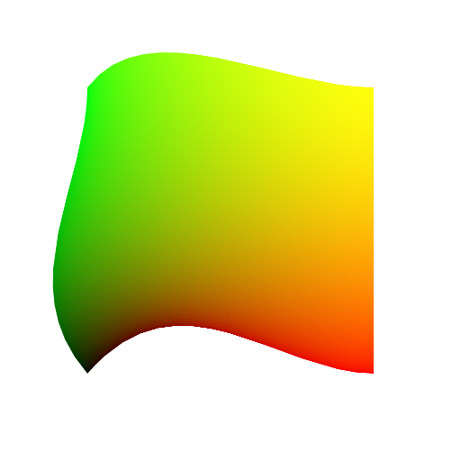
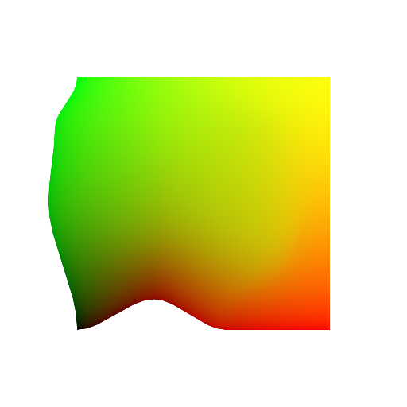

# SmartObjects

These test files are used to compare our warping code to that of photoshop. The goal is not 100% numerical accuracy but rather a visually similar result.
All of the layers of the ./smart_objects_transformed.psd file have been exported into the ./reference folder which will be used for comparison.

The layers of the smart object display all the supported behaviour of smart objects at the moment which is:

- affine transformations
- non affine transformations
- simple warps (the default warp rect)
- quilt warps (if more divisions were added manually)

Once more warp modes like puppet warp and Edit->Perspective get supported these should be reflected here as well.

# Simple warp

# Quilt warps

