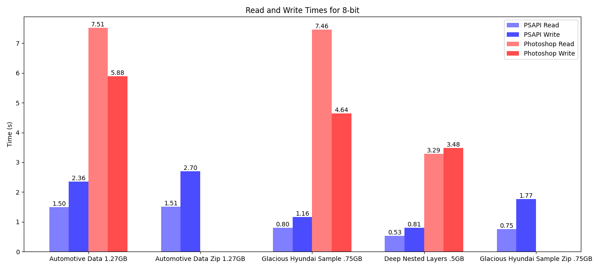
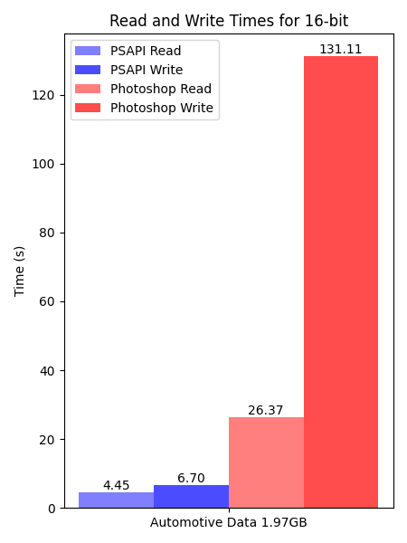
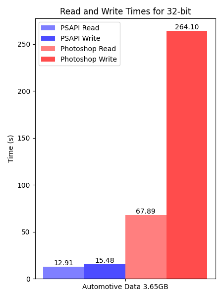

# PhotoshopAPI

[](https://ko-fi.com/Q5Q4TYALW)


[](https://isocpp.org/)
[](https://photoshopapi.readthedocs.io/en/latest/?badge=latest)
[](https://github.com/EmilDohne/PhotoshopAPI/actions/workflows/cmake-build.yml)
[](https://github.com/EmilDohne/PhotoshopAPI/actions/workflows/cmake-test.yml)
[](https://github.com/EmilDohne/PhotoshopAPI/actions/workflows/build-wheels.yml)
[](https://pypi.org/project/PhotoshopAPI/)


> [!NOTE]
> The PhotoshopAPI is still in early development status which means it is subject to change and will likely include bugs. If you find any please report them to the issues page

About
=========

**PhotoshopAPI** is a C++20 Library with Python bindings for reading and writing of Photoshop Files (*.psd and *.psb) based on previous works from [psd_sdk](https://github.com/MolecularMatters/psd_sdk>),
[pytoshop](https://github.com/mdboom/pytoshop) and [psd-tools](https://github.com/psd-tools/psd-tools>). As well as the official 
[Photoshop File Format Specification](https://web.archive.org/web/20231122064257/https://www.adobe.com/devnet-apps/photoshop/fileformatashtml/), where applicable.
The library is continuously tested for correctness in its core functionality. If you do find a bug
please submit an issue to the github page.

The motivation to create another library despite all the other works present is that there isn't a library which has layer editing as a first class citizen while also supporting 
all bit-depths known to Photoshop (``8-bits``, ``16-bits``, ``32-bits``). This Library aims to create an abstraction between the raw binary file format and the structure that the user interfaces
against to provide a more intuitive approach to the editing of Photoshop Files. 

Why should you care?
====================

Photoshop itself is unfortunately often slow to read/write files and the built-in tools for automatically/programmatically modifying files suffer this same issue. On top of this, due to the 
extensive history of the Photoshop File Format, Photoshop files written out by Photoshop itself are often unnecessarily bloated to add backwards compatibility or cross-software compatibility.

The PhotoshopAPI tries to address these issue by allowing the user to read/write/modify Photoshop Files without ever having to enter Photoshop itself which additionally means, no license 
is required. It is roughly 5-10x faster in reads and 20x faster in writes than photoshop while producing files that are consistently 20-50% lower in size (see the benchmarks section on readthedocs for details).
The cost of parsing is paid up front either on read or on write so modifying the layer structure itself is almost instantaneous (except for adding new layers).


Features
=========

Supported:
- Read and write of \*.psd and \*.psb files
- Creating and modifying simple and complex nested layer structures
- Pixel Masks
- Modifying layer attributes (name, blend mode etc.)
- Setting the Display ICC Profile
- Setting the DPI of the document
- 8-, 16- and 32-bit files
- RGB Color Mode
- All compression modes known to Photoshop

Planned:
- Support for Adjustment Layers
- Support for Vector Masks
- Support for Text Layers
- Support for Smart Object Layers
- CMYK, Indexed, Duotone and Greyscale Color Modes

Not Supported:
- Files written by the PhotoshopAPI do not contain a valid merged image in order to save size meaning they will not behave properly when opened in
    third party apps requiring these (such as Lightroom)
- Lab and Multichannel Color Modes 


Documentation
===============

The full documentation with benchmarks, build instructions and code reference is hosted on the [PhotoshopAPI readthedocs page](https://photoshopapi.readthedocs.io/).


Requirements
=============

This goes over requirements for usage, for development requirements please visit the [docs](https://photoshopapi.readthedocs.io/).

- A CPU with AVX2 support (this is most CPUs after 2014). If you are unsure, please refer to your CPUs specification
- A 64-bit system
- C++ Library: **Linux**, **Windows** or **MacOS** (M-Chips are not tested)
- Python Library<sup>1</sup>: **Windows**, **MacOS** (M-Chips are not tested)

> <sup>1</sup> Currently Linux is not supported as the manylinux image for cibuildwheels does not yet support C++20

Performance
===========

The PhotoshopAPI is built with performance as one of its foremost concerns. Using it should enable you to optimize your pipeline rather than slow it down. It runs fully multithreaded with 
SIMD instructions to leverage all the computing power your computer can afford. 

As the feature set increases this will keep being one of the key requirements.
For detailed benchmarks running on a variety of different configurations please visit the [docs](https://photoshopapi.readthedocs.io/)

Below you can find some of the benchmarks comparing the PhotoshopAPI ('PSAPI') against Photoshop in read/write performance

[](https://photoshopapi.readthedocs.io/en/latest/benchmarks.html)





Python Wrapper
==============

The PhotoshopAPI comes with fully fledged Python bindings which can be simply installed using

```
$ py -m pip install PhotoshopAPI
```

alternatively the wheels can be downloaded from the Releases page. For examples on how to use the python bindings please refer to the Python Bindings section on [Readthedocs](https://photoshopapi.readthedocs.io/en/latest/index.html) or check out the PhotoshopExamples/ directory on
the github page which includes fully fledged python examples.


Quickstart
==========

The primary struct to familiarize yourself with when using the PhotoshopAPI is the LayeredFile as well as all its Layer derivatives (such as ImageLayer and 
GroupLayer), all of these are template structs for each of the available bit depths. 

To get a feel of what is possible with the API as well as how to use it please refer to ``PhotoshopExample/`` directory. To familiarize
yourself with the main concepts, as well as recommended workflows check out the [docs](https://photoshopapi.readthedocs.io/) or the [examples](https://github.com/EmilDohne/PhotoshopAPI/tree/master/PhotoshopExamples).

If more fine grained control over the binary structure is necessary, one can modify the PhotoshopFile which is what is parsed by the API internally.
Do keep in mind that this requires a deep understanding of how the Photoshop File Format works. 

Below is a minimal example to get started with opening a PhotoshopFile, removing some layer, and writing the file back out to disk:

### C++ 

```cpp	
using namespace PhotoshopAPI;

// Initialize an 8-bit layeredFile. This must match the bit depth of the PhotoshopFile.
// To initialize this programmatically please refer to the ExtendedSignature example
LayeredFile<bpp8_t> layeredFile = LayeredFile<bpp8_t>::read("InputFile.psd");

// Do some operation, in this case delete
layeredFile.removeLayer("SomeGroup/SomeNestedLayer");	

// One could write out to .psb instead if wanted and the PhotoshopAPI will take 
// care of any conversion internally
LayeredFile<bpp8_t>::write(std::move(layeredFile), "OutputFile.psd");
```

### Python

```py
import psapi

# Read the layered_file using the LayeredFile helper class, this returns a 
# psapi.LayeredFile_*bit object with the appropriate bit-depth
layered_file = psapi.LayeredFile.read("InputFile.psd")

# Do some operation, in this case delete
layered_file.remove_layer()

# Write back out to disk
layered_file.write("OutFile.psd")
```

The same code for reading and writing can also be used to for example `LayeredFile::moveLayer` or `LayeredFile::addLayer` as well as extracting any image data
